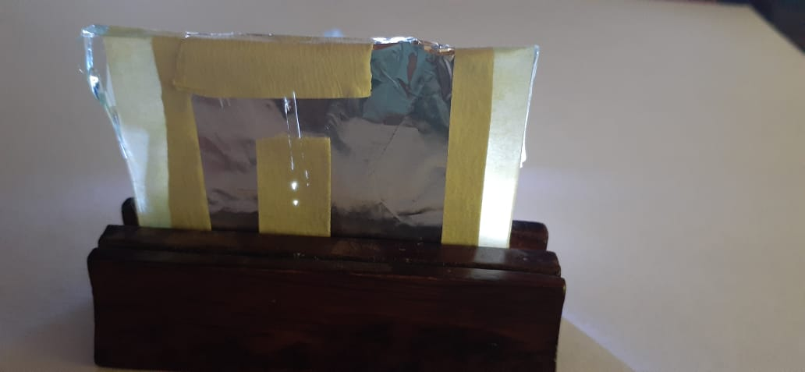
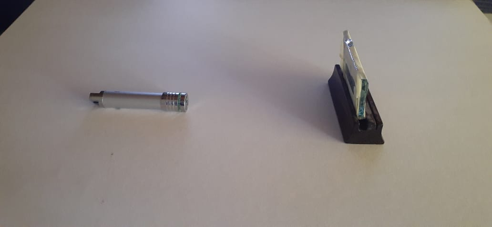
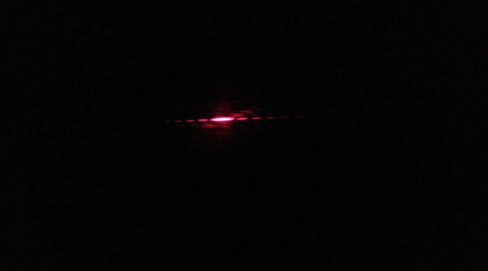
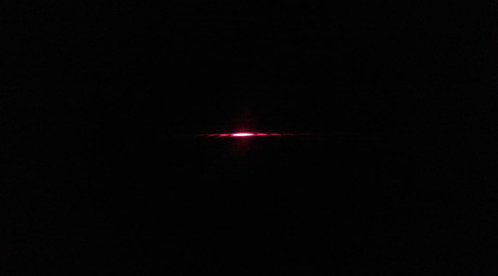

# Doble-Rendija-
En este repositorio observara una simulacion del experimento de la doble rendija y tambien encontrara la explicacion basada en la computacion cuantica 

# Construccion
### materiales
- un laser
- una aguja
- papel aluminio
- un trozo de vidrio 
- cinta (que no sea transparente)
- un trozo de un palo de valso  (mas grueso que el grozor del vidrio, sera para hacer la base de la rendija)

### pasos:

- tomamos el trozo de vidrioo una de las caras debemos envolverla con el papel aluminio
- con la aguja vamos a crear las rendijas en el papel aluminio, las rendijas deben ser mas pequeñas que el diametro del laser
- por ultimo con la cinta vamos a cubrir las zonas por donde no queremos que la luz pase, tambien podemos utilizar la cinta para corregir las rendijas 

Deebemos obtener el siguiente redultado:

-  luego vamos a crear la base para el trozo de vidrio, haciendo una ranura del ancho del vidrio en el palo de balso y listo tenemos el sistema de la doble rendija asi:

# Resultado

Entre mayor sea la distancia entre la rendija y la pared o lugar donde proyectaremos el resultado, se observara mayor separacion entre los fotones 

# Explicacion

Hoy en día, la teoría más aceptada por el mundo científico es que el "elemento" u "objeto" que está afectando el fotón y haciendo que este cambie su tracyectoria, crea una historia del foton, que pertenece a otro universo, que afecta a nuestro foton original, si creamos una acumulacion de fotones se crearan multiples historias que se traduciran entrayectorias y seran reflejadas en la pared.

# Autor

Esteban Camilo Archila Bastidas
